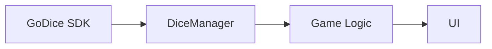

# YahtzeeGoDice

**YahtzeeGoDice** is a mobile application that brings the classic game **Yahtzee** to life using physical **GoDice** smart dice.  
The app uses Bluetooth Low Energy to connect with GoDice and react to real dice rolls in real-time.

---

## 🎯 Features

-   Connect and manage multiple GoDice devices
-   Real-time roll detection and color updates
-   Optional Mock Dice mode for development (dice appear only after tapping **Scan Dice**)
-   Full Yahtzee gameplay mechanics:
    -   Up to 3 rolls per turn
    -   Automatic scoring system
    -   All standard scoreboard fields
-   Simple and intuitive mobile UI
-   Game progress synced with physical dice actions

> Project status: **Work in progress** 🚧

---

## 🧩 Technologies

-   **Kotlin / Android**
-   **Bluetooth Low Energy** communication
-   GoDice Official SDK:
    -   <https://github.com/ParticulaCode/GoDiceAndroid_iOS_API>
-   Architecture based on Manager + Observer pattern

---

## 📦 Installation & Setup

1. Clone the repository:

    ```bash
    git clone https://github.com/p-marcol/YahtzeeGoDice.git
    cd YahtzeeGoDice
    ```

2. Open the project in Android Studio
3. Connect a real Android device (BLE features are not supported on most emulators)
4. Pair your GoDice and run the app ✅

---

## 🧪 Mock Dice Mode

Need to work without real hardware? Use the `mock` build flavor:

```bash
./gradlew :app:assembleMockDebug
```

In this flavor the app wires itself to `MockDiceManager`. Mock dice are created **only after** you tap the **Scan Dice** button, mirroring the flow of the real scanner. Everything else (selection, LED prompts, UI updates) behaves the same, so you can iterate quickly before testing on real GoDice.

Switch back to the `real` flavor when targeting physical dice:

```bash
./gradlew :app:assembleRealDebug
```

---

## 🔗 GoDice SDK Integration

The project uses the official GoDice Android/iOS API for:

-   Listening to physical dice events (roll, color, battery)
-   Mapping SDK dice identifiers to in-app dice
-   Updating UI and game logic based on sensor data

Example listener initialization:

```kotlin
init {
    GoDiceSDK.listener = object : GoDiceSDK.Listener {
        override fun onDiceColor(diceId: Int, color: Int) {
            Log.d("DiceManager", "Dice color changed: ID=$diceId, Color=$color")
            val dice = dices.values.firstOrNull { it.getSdkId() == diceId } ?: return
            dice.color = color
            listeners.forEach { it.onColorChanged(dice, color) }
        }
    }
}
```

📌 **Important:**
The listener must be set before making any other SDK calls
to ensure no events are lost.

---

## 🧱 Architecture Overview



-   `DiceManager` — central BLE & SDK communication controller
-   Observer pattern for distributing events across UI and logic
-   Clear separation between hardware layer and game mechanics

---

## License

License: **TBD**
Note: The **GoDice SDK** has its own licensing terms. Please refer to the official GoDice repository for details.

---

## Authors

-   **Piotr Marcol** - [p-marcol](https://github.com/p-marcol)
-   **Jakub Barylak** - [Jakub-Barylak](https://github.com/Jakub-Barylak)

---

_Project developed as part of the course **Mobile Application Design**, Silesian University of Technology, 2025._

---

That's all folks!
Place your bets, shuffle the code, and may RNGesus smile upon you.
